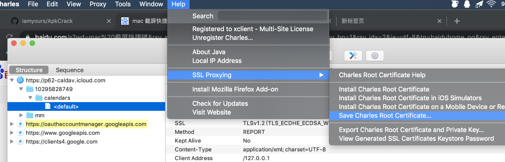
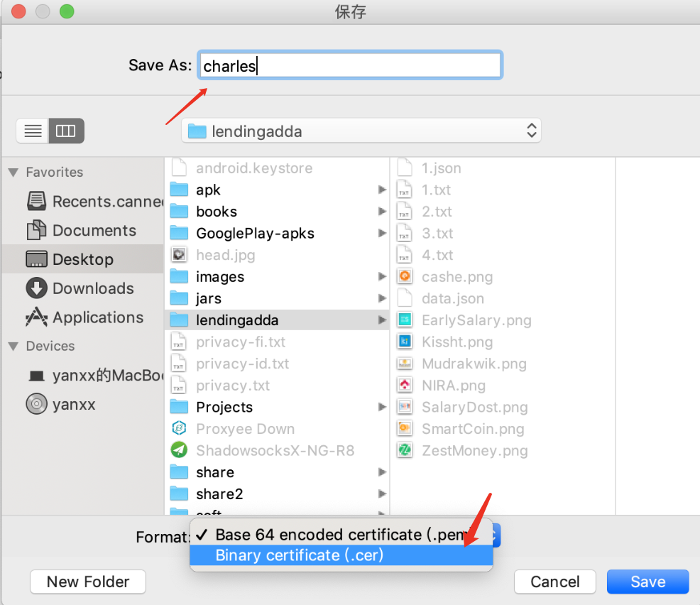
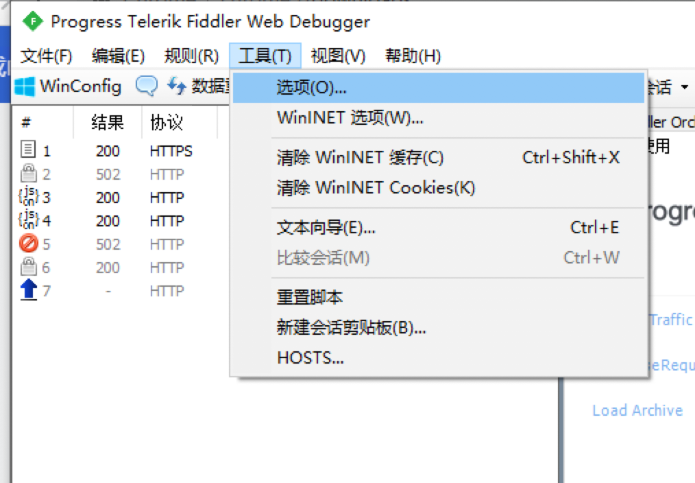
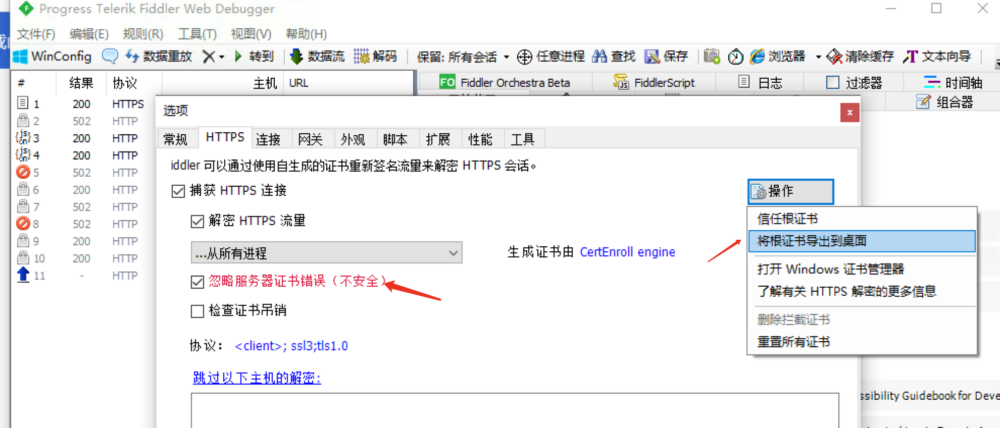
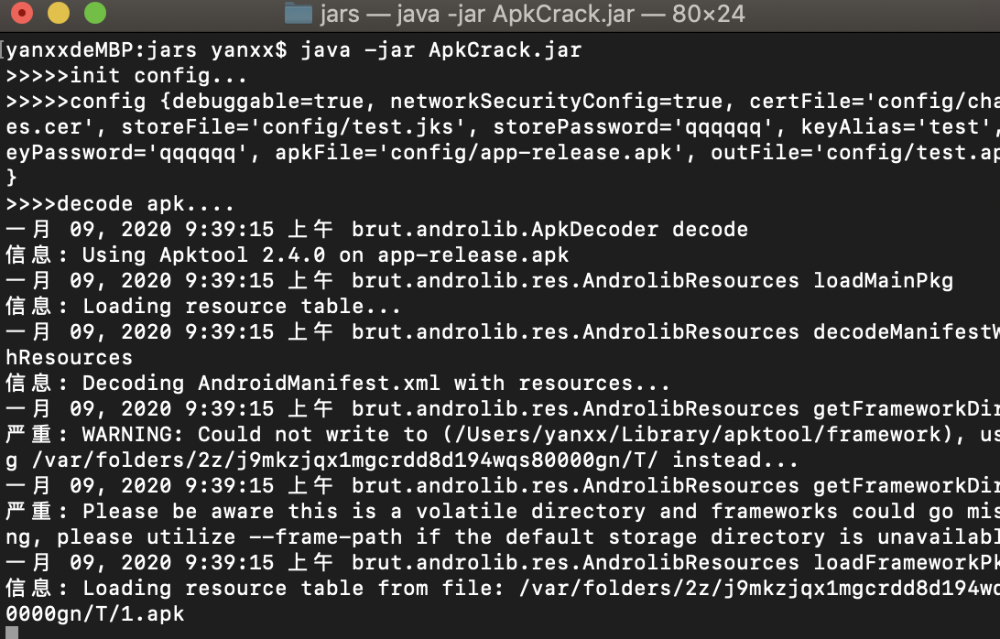
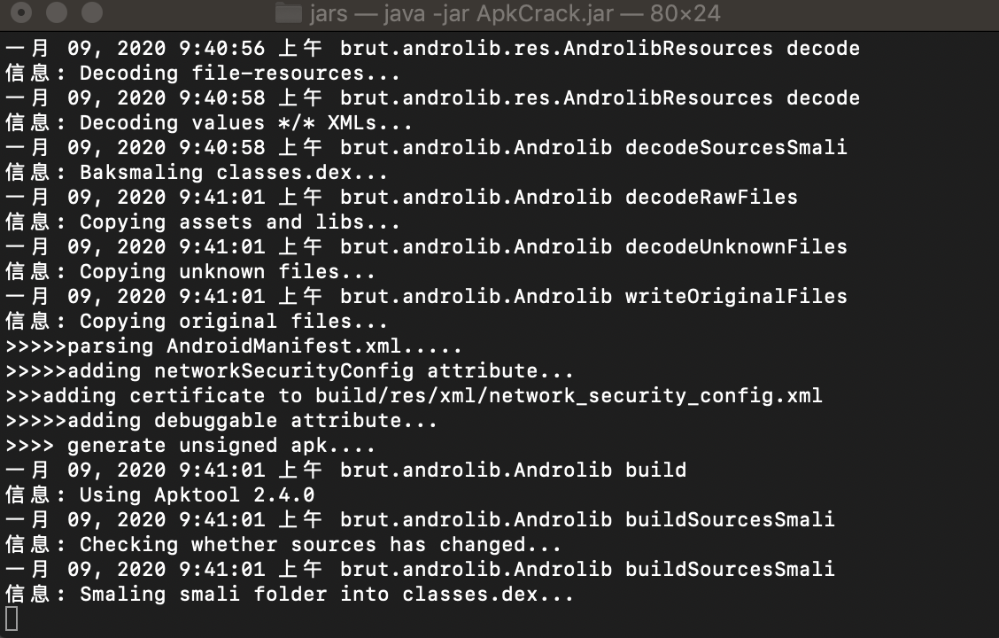
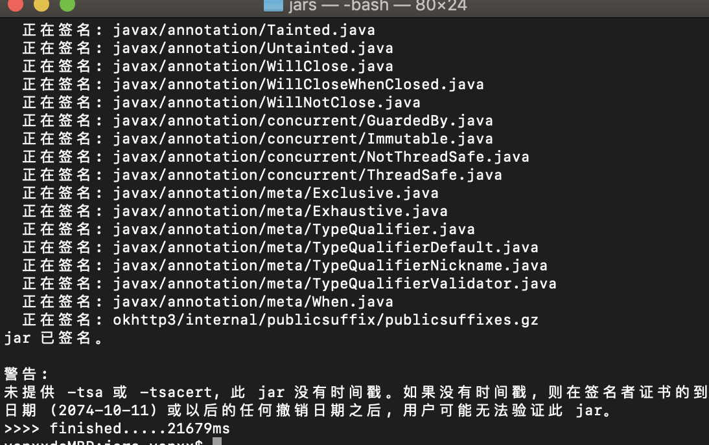
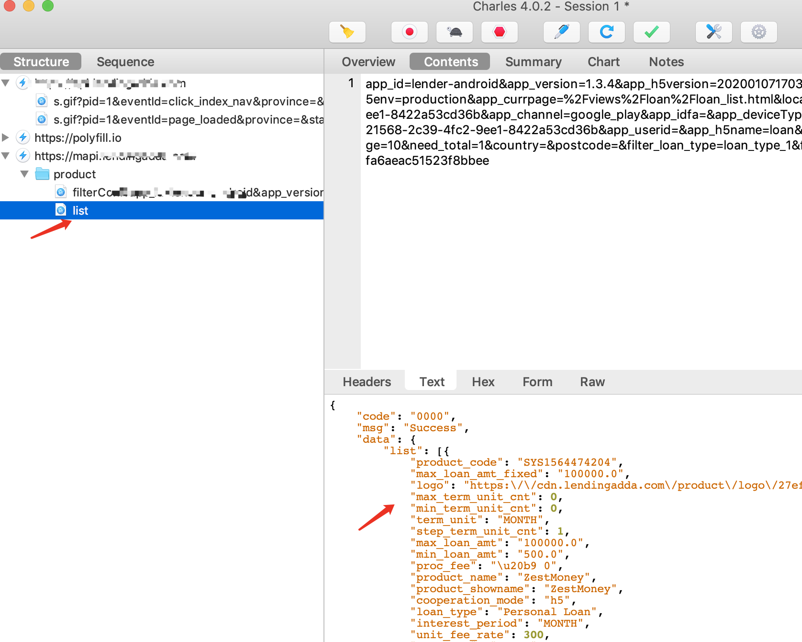
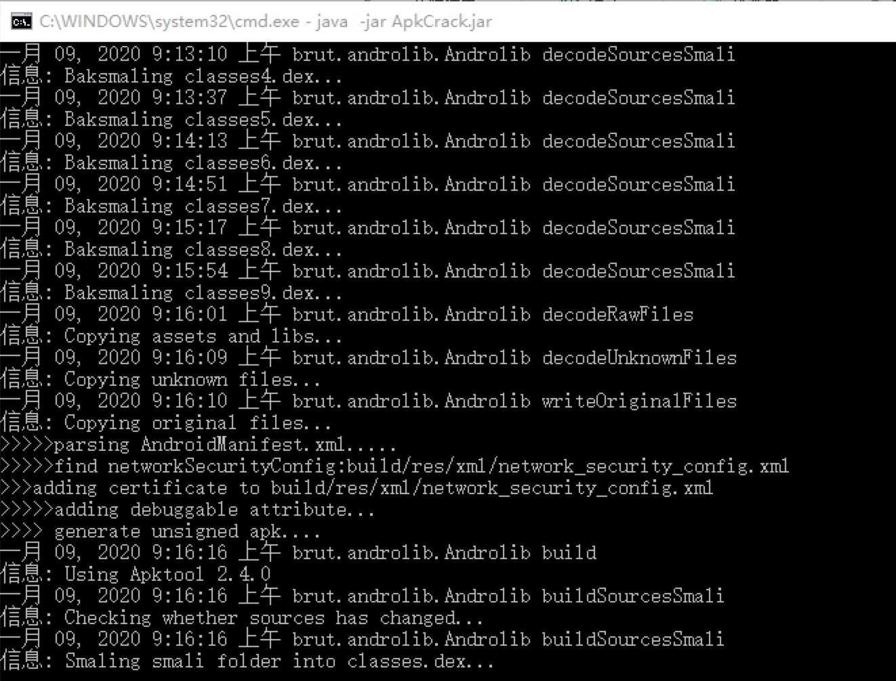
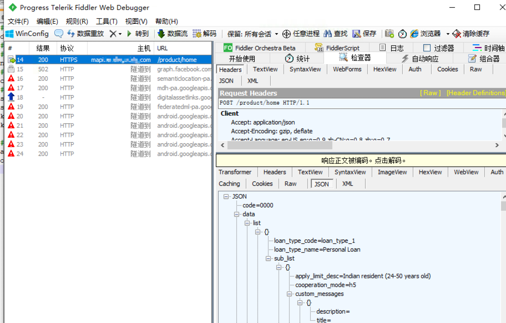

## A tool that make your apk debuggable for Charles/Fiddler in Android 7.0

## requirement
- jdk
- make sure `jarsigner` works
- Fiddler/Charles


## config file in `config/config.properties`
- add apk path,out apk path
- add your sign file(or you can use test.jks)
- add your certFile that export from Charles/Fiddler。

## how to use
[download zip](https://github.com/iamyours/ApkCrack/releases),and unzip it.
``` sh
java -jar ApkCrack.jar
```

## export cert file from Charles
open Charles,then `Help` -> `SSL Proxying` -> `Save Charles Root Certificate...` -> `change Format to Binary certificate(.cer)`-> `Save` 
 


## export cert file from Fiddler




## ApkCrack for mac








## ApkCrack for windows







